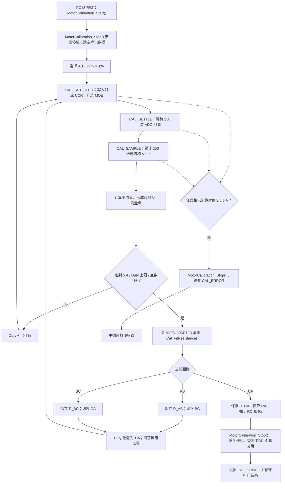
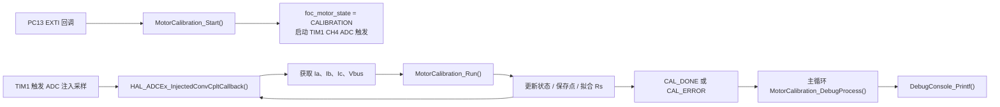

# 参数辨识：定子电阻 Rs

> 本文记录当前 `Observer_Motor` 工程中的电阻辨识实现。相关代码：`App/Calibration/motor_calibration.c`、`App/Calibration/motor_calibration.h`、`Core/Src/main.c`、`Core/Src/stm32g4xx_it.c`。

## 1. 辨识原理与整体流程

采用 **AB → BC → CA 三组线间通电、PWM 阶梯升压、稳态平均采样、最小二乘拟合** 的方法。每档占空比先等待电流稳定，再平均采集电流和母线电压；达到终止条件后，取最后最多 5 个测量点拟合线间电阻，最终换算三相相电阻和平均定子电阻 `Rs`。

### 状态机

| 状态 | 当前动作 | 下一步 |
|---|---|---|
| `CAL_IDLE` | 未进行辨识 | 等待启动 |
| `CAL_SET_DUTY` | 清空本档累加器，`Cal_SetDuty()` 设置 PWM 并开启 MOE | `CAL_SETTLE` |
| `CAL_SETTLE` | 等待 250 次 ADC 回调，不累加测量值 | `CAL_SAMPLE` |
| `CAL_SAMPLE` | 累计 250 次电流与 Vbus；保存一组平均值 | 增加 Duty 或拟合、切相 |
| `CAL_DONE` | Rs 已保存，功率输出关闭，等待主循环打印 | 停止 |
| `CAL_ERROR` | 保护或异常退出，等待主循环打印错误 | 停止 |

## 2. 参数和单档时序

参数定义位于 `App/Calibration/motor_calibration.h`：

| 参数 | 数值 | 含义 |
|---|---:|---|
| `CAL_DUTY_START` | 1% | 初始占空比 |
| `CAL_DUTY_STEP` | 0.5 个百分点 | 每档递增 |
| `CAL_DUTY_MAX` | 50% | 占空比上限 |
| `CAL_TARGET_CURRENT` | 5 A | 当前回路正常结束电流 |
| `CAL_HARD_CURRENT` | 5.5 A | 任一相瞬时软件过流阈值 |
| `CAL_SETTLE_COUNT` | 250 | 每档稳定等待次数 |
| `CAL_SAMPLE_COUNT` | 250 | 每档平均采样次数 |
| `CAL_MAX_POINTS` | 50 | 每组回路最多保存的测量点 |
| `CAL_FIT_POINTS` | 5 | 取最后最多 5 个点拟合 |

当前 ADC 回调按 25 kHz 运行时，250 次约 10 ms，因此 **每档约等待 10 ms + 采样 10 ms = 20 ms**（不包含状态切换及其他软件开销）。

## 3. 三组桥臂配置

`Motor_PinMode()` 用于切换引脚为 GPIO LOW、GPIO HIGH 或 TIM1 PWM 复用模式；`Cal_ConfigPhaseA/B/C()` 按回路调用它。

| 测试回路 | PWM 引脚 | GPIO HIGH | 其他引脚 |
|---|---|---|---|
| AB | AH | BL | GPIO LOW |
| BC | BH、BL（TIM1 主/互补 PWM） | CL | GPIO LOW |
| CA | CH、CL（TIM1 主/互补 PWM） | AL | GPIO LOW |

上述表格是**当前代码实际配置**，不是正常 FOC 的三相驱动配置。换相前先关闭 MOE，并将 CCR1~CCR3 清零；中途切相**不调用**完整 `MotorCalibration_Stop()`，以免退出辨识并关闭 ADC 触发。

## 4. 计算方法

### 4.1 单档平均值

`Cal_LineCurrent()` 根据当前回路取两相电流绝对值的平均。例如 AB：

\[
I_{AB}=\frac{|I_A|+|I_B|}{2}.
\]

250 次采样平均：

\[
\bar I=\frac{1}{250}\sum_{k=1}^{250} I_k,\qquad
\bar V_{bus}=\frac{1}{250}\sum_{k=1}^{250}V_{bus,k}.
\]

当前代码保存的测量点为：

\[
V=Duty\cdot\bar V_{bus},\qquad I=\bar I.
\]

这里的 `Duty × Vbus` 是**有效注入电压近似值**，未单独补偿 MOS、采样电阻、死区等功率回路压降。

### 4.2 线间电阻拟合

`Cal_FitResistance()` 使用最后最多 5 组 `(I,V)`，最小二乘拟合 `V=RI+b`，斜率作为本组线间电阻：

\[
R=\frac{n\sum IV-\sum I\sum V}{n\sum I^2-(\sum I)^2}.
\]

点数小于 2 或分母绝对值过小时返回 `0`。依次得到 `R_AB`、`R_BC`、`R_CA`。

### 4.3 计算单相电阻 Rs

按三相绕组近似为星形线间串联电阻的关系：

\[
R_A=\frac{R_{AB}+R_{CA}-R_{BC}}{2},
\quad
R_B=\frac{R_{AB}+R_{BC}-R_{CA}}{2},
\quad
R_C=\frac{R_{BC}+R_{CA}-R_{AB}}{2}.
\]

最终：

\[
\boxed{R_s=\frac{R_A+R_B+R_C}{3}
=\frac{R_{AB}+R_{BC}+R_{CA}}{6}}.
\]

## 5. 关键函数与调用关系

| 函数 | 文件 | 用途 |
|---|---|---|
| `MotorCalibration_Start()` | `motor_calibration.c` | 调用 Stop 进入安全停机，清零结构体，从 AB、1% 开始 |
| `MotorCalibration_Run()` | `motor_calibration.c` | **核心状态机**；每次 ADC 注入转换完成回调推进一次 |
| `Motor_PinMode()` | `motor_calibration.c` | 切换六路桥臂引脚的 GPIO/PWM 模式 |
| `Cal_ConfigPhaseA/B/C()` | `motor_calibration.c` | 配置当前线间测量回路 |
| `Cal_SetDuty()` | `motor_calibration.c` | `Duty × TIM1->ARR` 换算 CCR，开启 MOE |
| `Cal_LineCurrent()` | `motor_calibration.c` | 当前回路的两相电流绝对值平均 |
| `Cal_FitResistance()` | `motor_calibration.c` | 最后最多 5 点拟合 `V-I` 斜率 |
| `MotorCalibration_Stop()` | `motor_calibration.c` | 统一关断功率输出、关闭 PWM/ADC 触发，恢复 TIM1 六路引脚复用，切换 IDLE |
| `MotorCalibration_DebugProcess()` | `motor_calibration.c` | 主循环中检测 `CAL_DONE/CAL_ERROR` 变化并打印一次 |

实际调用链：

当 `foc_motor_state == FOC_MOTOR_CALIBRATION`，ADC 回调调用 `MotorCalibration_Run(...)` 后立即 `return`，不再运行正常的 FOC 控制链。

## 6. 结束、恢复及注意事项

`MotorCalibration_Stop()` 的当前退出顺序：

1. 状态设为 `CAL_IDLE`，关闭 MOE，CCR1~CCR3 清零。
2. 六路功率引脚全部切换为 GPIO LOW。
3. `FOC_PWM_Stop()` 关闭 PWM 与 CH4 ADC 触发。
4. `HAL_TIM_MspPostInit(&htim1)` 恢复六路 TIM1 复用引脚。
5. `foc_motor_state = FOC_MOTOR_IDLE`，**不会自动重新启动电机**。

正常完成后，`MotorCalibration_Run()` 再设置 `CAL_DONE`；过流或异常退出时再设置 `CAL_ERROR`，使主循环能够输出结果或错误。Rs 结果仍保留在 `motor_cal` 中。

- `point[]` 为三组回路共用；每次切换回路时清零 `point_count`。最终打印的逐档点主要为 CA 组，但三组电阻及 Rs 都分别保存。
- 5.5 A 是软件 ADC 回调检查，**不能替代硬件快速过流关断**。
- 本文记录的是当前代码逻辑，采样频率、桥臂波形和电阻准确度仍须以实际上板测量确认。
