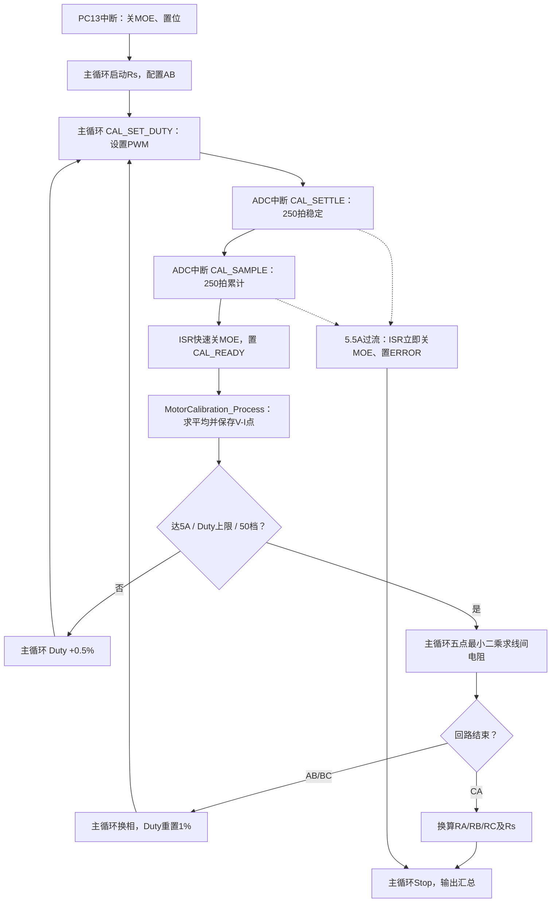
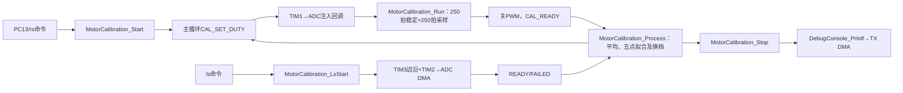

# 参数辨识：定子电阻 Rs 与电感 Ls

> 本文记录 `Observer_Motor` 的 Rs、Ls 辨识实现。核心代码位于 `App/Calibration/motor_calibration.c/.h`，串口命令在 `App/Control/motor_app.c`，ADC DMA 回调在 `App/Control/foc_math.c`，TIM3 中断在 `Core/Src/stm32g4xx_it.c`。

## 1. 辨识原理与整体流程

采用 **AB → BC → CA 三组线间通电、PWM 阶梯升压、稳态平均采样、最小二乘拟合** 的方法。每档占空比先等待电流稳定，再平均采集电流和母线电压；达到终止条件后，取最后最多 5 个测量点拟合线间电阻，最终换算三相相电阻和平均定子电阻 `Rs`。

### 状态机

| 状态 | 当前动作 | 下一步 |
|---|---|---|
| `CAL_IDLE` | 未进行辨识 | 等待启动 |
| `CAL_SET_DUTY` | 主循环清空累加器，`Cal_SetDuty()` 设置PWM并开启MOE | `CAL_SETTLE` |
| `CAL_SETTLE` | 等待 250 次 ADC 回调，不累加测量值 | `CAL_SAMPLE` |
| `CAL_SAMPLE` | ADC中断累计250次电流与Vbus；到点立即关PWM | `CAL_READY` |
| `CAL_READY` | 主循环求平均、存五点缓存、升档或拟合/换相 | `CAL_SET_DUTY` / `CAL_DONE` |
| `CAL_DONE` | ISR已关功率级，主循环恢复外设并打印 | 停止 |
| `CAL_ERROR` | ISR已关功率级，主循环恢复外设并打印错误 | 停止 |

## 2. 参数和单档时序

参数定义位于 `App/Calibration/motor_calibration.h`：

| 参数 | 数值 | 含义 |
|---|---:|---|
| `CAL_DUTY_START` | 1% | 初始占空比 |
| `CAL_DUTY_STEP` | 0.5 个百分点 | 每档递增 |
| `CAL_DUTY_MAX` | 50% | 占空比上限 |
| `CAL_TARGET_CURRENT` | 5 A | 当前回路正常结束电流 |
| `CAL_HARD_CURRENT` | 5.5 A | 任一相瞬时软件过流阈值 |
| `CAL_SETTLE_COUNT` | 250 | 每档稳定等待次数 |
| `CAL_SAMPLE_COUNT` | 250 | 每档平均采样次数 |
| `CAL_MAX_POINTS` | 50 | 每组回路最多测量50档（RAM只保留最后5档） |
| `CAL_FIT_POINTS` | 5 | 取最后最多 5 个点拟合 |

当前 ADC 回调按25 kHz运行，250次约10 ms；每档先稳定10 ms，再采样10 ms。**采满时ISR关闭PWM，下一档由主循环重新开启**，所以档间新增主循环调度间隔，仍需实机与旧版电阻结果对照。

## 3. 三组桥臂配置

`Motor_PinMode()` 用于切换引脚为 GPIO LOW、GPIO HIGH 或 TIM1 PWM 复用模式；`Cal_ConfigPhase()` 在主循环使用 `switch` 配置三组回路。

| 测试回路 | PWM 引脚 | GPIO HIGH | 其他引脚 |
|---|---|---|---|
| AB | AH | BL | GPIO LOW |
| BC | BH、BL（TIM1 主/互补 PWM） | CL | GPIO LOW |
| CA | CH、CL（TIM1 主/互补 PWM） | AL | GPIO LOW |

上述表格是**当前代码实际配置**，不是正常 FOC 的三相驱动配置。换相前先关闭 MOE，并将 CCR1~CCR3 清零；中途切相**不调用**完整 `MotorCalibration_Stop()`，以免退出辨识并关闭 ADC 触发。

## 4. 计算方法

### 4.1 单档平均值

`Cal_LineCurrent()` 根据当前回路取两相电流绝对值的平均。例如 AB：

\[
I_{AB}=\frac{|I_A|+|I_B|}{2}.
\]

250 次采样平均：

\[
\bar I=\frac{1}{250}\sum_{k=1}^{250} I_k,\qquad
\bar V_{bus}=\frac{1}{250}\sum_{k=1}^{250}V_{bus,k}.
\]

当前代码保存的测量点为：

\[
V=Duty\cdot\bar V_{bus},\qquad I=\bar I.
\]

这里的 `Duty × Vbus` 是**有效注入电压近似值**，未单独补偿 MOS、采样电阻、死区等功率回路压降。

### 4.2 线间电阻拟合

`Cal_FitResistance()` 使用最后最多 5 组 `(I,V)`，最小二乘拟合 `V=RI+b`，斜率作为本组线间电阻：

\[
R=\frac{n\sum IV-\sum I\sum V}{n\sum I^2-(\sum I)^2}.
\]

点数小于 2 或分母绝对值过小时返回 `0`。依次得到 `R_AB`、`R_BC`、`R_CA`。

### 4.3 计算单相电阻 Rs

按三相绕组近似为星形线间串联电阻的关系：

\[
R_A=\frac{R_{AB}+R_{CA}-R_{BC}}{2},
\quad
R_B=\frac{R_{AB}+R_{BC}-R_{CA}}{2},
\quad
R_C=\frac{R_{BC}+R_{CA}-R_{AB}}{2}.
\]

最终：

\[
\boxed{R_s=\frac{R_A+R_B+R_C}{3}
=\frac{R_{AB}+R_{BC}+R_{CA}}{6}}.
\]

## 5. 关键函数与调用关系

| 函数 | 文件 | 用途 |
|---|---|---|
| `MotorCalibration_Start()` | `motor_calibration.c` | 调用 Stop 进入安全停机，清零结构体，从 AB、1% 开始 |
| `MotorCalibration_Run()` | `motor_calibration.c` | ADC中断只做过流保护、稳定等待、采样累加和发布READY |
| `Motor_PinMode()` | `motor_calibration.c` | 切换六路桥臂引脚的 GPIO/PWM 模式 |
| `Cal_ConfigPhase()` | `motor_calibration.c` | 按当前回路配置六路桥臂 |
| `Cal_SetDuty()` | `motor_calibration.c` | `Duty × TIM1->ARR` 换算 CCR，开启 MOE |
| `Cal_LineCurrent()` | `motor_calibration.c` | 当前回路的两相电流绝对值平均 |
| `Cal_FitResistance()` | `motor_calibration.c` | 最后最多 5 点拟合 `V-I` 斜率 |
| `MotorCalibration_Stop()` | `motor_calibration.c` | 先安全关断，再调用MX_TIM1_Init/MX_ADCx_Init恢复原始外设配置 |
| `DebugConsole_LogProcess()` | `debug_console.c` | 主循环分批格式化其他模块提交的通用数值日志 |
| `MotorCalibration_Process()` | `motor_calibration.c` | Rs/Ls统一主循环入口：数据处理、换档/换相、拟合、恢复和输出 |

实际调用链：

当 `foc_motor_state == FOC_MOTOR_CALIBRATION`，ADC 回调调用 `MotorCalibration_Run(...)` 后立即 `return`，不再运行正常的 FOC 控制链。JustFloat 在正常 FOC 路径中直接通过 DMA 发送原始 6 个 float + `0x7F800000` 帧尾（28 字节），不经过文本格式化；文本待发送时让出 USART2。

## 6. 结束、恢复及注意事项

`MotorCalibration_Stop()` 的当前退出顺序：

1. 中断仅快速关闭 MOE/CCR 或 Ls GPIO 脉冲，主循环执行完整 Stop。
2. 先停止 PWM，六路功率引脚切为 GPIO LOW；Ls 还要关闭 TIM2/TIM3 与 ADC DMA。
3. Ls 结束调用对应 `MX_ADC1_Init()` 或 `MX_ADC2_Init()`，重新启动所选 ADC 注入组；CA 的母线/温度规则组 DMA 由下轮 `ADC_Regular_Service()` 恢复。
4. 调用 `MX_TIM1_Init()` 恢复 25 kHz、死区、CH4 触发及六路复用，并强制 MOE/CEN/输出使能关闭。
5. 设置 `FOC_MOTOR_IDLE`，**不会自动启动电机**；不保存整套外设寄存器快照。

Rs中断在每档完成时快速关断并设置`CAL_READY`，主循环负责平均、拟合、升档和换相；过流时ISR设置`CAL_ERROR`，完整Stop及输出均由主循环完成。Rs/Ls结果仍保留在`motor_cal`中。

- `point[]` 为三组回路复用的5点环形缓存；每次换相清零 `point_count`。测量仍按最多50档进行，去掉逐档电压/电流调试日志，每组拟合结束由主循环输出线间电阻，并最终汇总Rs。
- 5.5 A 是软件 ADC 回调检查，**不能替代硬件快速过流关断**。
- 本文记录的是当前代码逻辑，采样频率、桥臂波形和电阻准确度仍须以实际上板测量确认。

## 7. 线间电感 Ls（AB / BC / CA）

- 命令：直接发送 `ls` 自动按 **AB → BC → CA** 辨识并输出三组汇总；`ls all` 等价。`ls ab`、`ls bc`、`ls ca` 仅用于单组调试；可显式附加平均相电阻，例如 `ls 0.509745`（三组）或 `ls ca 0.509745`（单组）；`ls stop` 取消整个自动序列。
- TIM3 比较事件在 40 μs 打开高侧，60 μs 关闭高侧；GPIO 换向留 1 μs 死区，TIM1 的 MOE 全程保持关闭。TIM2 以 400 kHz 触发 64 点 ADC DMA；半传输未见关断事件即终止。
- AB：AH→BL，ADC2_IN3 测 IB；BC：CH→BL，ADC2_IN3 测 IB；CA：CH→AL，ADC1_IN3 测 IA。仅 CA 暂停 ADC1 母线/温度 DMA；结束通过原CubeMX初始化恢复ADC/TIM1，由主循环重新启动规则组DMA。
- 自动序列仍由单回路的 `MotorCalibration_LsStart()` 和 `MotorCalibration_LsProcess()` 执行：**上一组DMA完成、双沿拟合有效且Stop恢复成功**，下一轮主循环才启动下一组，优先处理串口/按键停止。开始前清零三组旧Ls，任何一组过流、DMA、时序、超时或拟合无效均停止序列；已有的有效结果保留，未完成的回路保持0。
- 使用平均相电阻的两倍 `R_line=2×Rs` 补偿，不使用单独的 `R_AB/R_BC/R_CA`。分别拟合上升段与低侧同步续流下降段，输出各自 `L_line`、`Ls≈L_line/2`；两段都有效时输出算术均值。
- 保留 ADC 模拟看门狗 10 A、TIM3 事件时间/位置检查、DMA 半传输兜底及异常立即关断。外部硬件快速过流保护仍必须启用。仅输出两沿和综合电感，不打印原始 ADC 点。
- 电感结果与转子位置及续流波形有关，不以单次测量替代全转角精度验收。TIM2/3使用实际APB1定时器时钟，DWT使用SystemCoreClock，不再将168 MHz写死。

## 8. CAN辨识入口（沿用现有通信框架）

- 控制沿用现有`0x100`、24字节CAN FD帧，仅新增`Command=0x40`及Byte3的Action：`0x01` Rs、`0x02`完整Ls、`0x03/04/05`单独Ls AB/BC/CA、`0x06`停止、`0x07`读取结果、`0x08`连续Rs→Ls。连续模式从Rs得到的平均相电阻直接用于随后Ls的`2×Rs`补偿。
- CAN命令在原RX环形缓冲区由主循环处理，与串口/按键共享`MotorApp_StartRsCalibration()`、`MotorCalibration_LsStartAll()`和`MotorCalibration_Process()`，不复制辨识计算；接收中断不启停MOS。
- 辨识反馈为独立`0x340+NodeID`、64字节CAN FD事件帧，不占用原`0x300+NodeID`高速调试反馈。无需启用`DEBUG_SELECT`即可收到请求的受理、结果、失败和停止信息。完整结果为七个电阻float32（Ω）与三组Ls float32（μH），均在RAM中读取。
- `0x08`只有Rs结果有效且安全恢复后才排队Ls；两阶段之间留给主循环处理停止。Ls任一回路出现故障或双沿拟合无效均停止后续回路，反馈保留请求序号、有效位和故障码，未测完不报告整体成功。
- 帧字段、命令示例、状态及错误码的具体字节定义见[电机协议](电机协议.md)。

## 9. 辨识结果保存策略

- Rs 和三组 Ls 仅保存在运行时 RAM；上电重新初始化后不自动加载历史参数。
- `cal show` 仅显示 RAM 中的 `Rs/Ls_AB/Ls_BC/Ls_CA`；`cal save`、`cal load` 已删除。
- 本辨识模块不读取、擦除或写入最后一页共享 Flash；Bootloader 及其已有配置数据保持不变。
- 链接脚本保留原有末页预留布局，本轮仅删除标定持久化代码，不调整 Flash 分区。